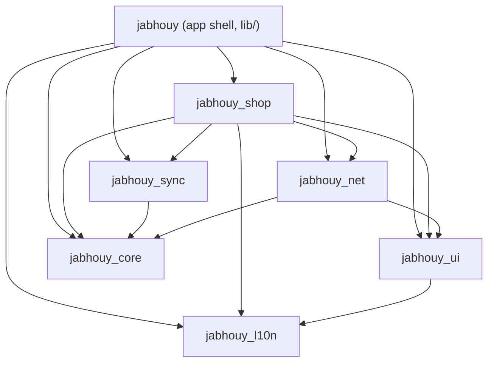

# Jabhouy architecture

**Status:** Implemented
**Author:** Punlork
**Updated:** 2026-09-28

## Summary

Jabhouy is a pub workspace: a Flutter app shell in `lib/` and six packages under `packages/`.
Every write lands in the local Drift database first and reaches the server through one queue, the outbox, which a pure-Dart engine drains.
A row describes what the seller sees and a queued job describes what the server has not heard yet, and the two are separate tables.
That separation is the decision everything else here serves: it is what lets a failed write retry, keep its reason, and wait for the row it depends on.

This file describes the system as built.
Why it took this shape, and what it cost to get here, is in [the restructure record](docs/ARCHITECTURE_RESTRUCTURE.md).

## Packages and what may import what



| Package | Holds | Flutter |
| --- | --- | --- |
| `jabhouy_core` | Drift schema (`AppDatabase`, schema 8), `Result`/`AppException`, `SyncStatus`, the outbox table, route names, `FeatureFlags`, `toIsoDate` | No |
| `jabhouy_sync` | `SyncEngine`, `BackoffPolicy`, the `FeatureSyncAdapter` port and `AdapterSyncTransport` | No |
| `jabhouy_net` | `ApiService`, `BaseService`, connectivity, request inspection | Yes |
| `jabhouy_ui` | Theme, assets, shared widgets, `TabScrollManager`, `UploadBloc` | Yes |
| `jabhouy_l10n` | The ARB catalog (English, Khmer) and `context.l10n` | Yes |
| `jabhouy_shop` | The shop and category feature, the one feature extracted as a package | Yes |

Edges come from each package's `pubspec.yaml`.
No package imports `package:jabhouy/`; workspace members share one package config, so the pubspec cannot enforce that, and `test/architecture/package_independence_test.dart` does.
`jabhouy_core` and `jabhouy_sync` have no Flutter dependency and run their tests under `dart test`.

The other features — auth, customer, home, income, loaner, profile, settings — stay folders in `lib/`.
Shop is a package as an experiment; the three shared packages beside it exist because each was the only way out of an import cycle, as the restructure record explains.

## Layers inside a feature

```text
<feature>/
├── ui/      bloc, pages, widgets
├── data/    repository interface and implementation, db/ (Drift DAO), api/ (HTTP), the sync adapter
└── logic/   use cases, only where a feature earns them
```

A bloc depends on a repository, or on a use case where one exists, and never on a Drift table or `ApiService`.
`logic/` imports no Flutter and no Drift, and `test/architecture/logic_layer_test.dart` walks the import closure of every `logic/` file to hold it to that.

Two features have a `logic/` folder:

| Feature | Use case | Why it earned one |
| --- | --- | --- |
| loaner | `RefreshLoanersUseCase` | Merges two repositories: a loan references a customer |
| income | `PullRemoteNotificationsUseCase` | Fingerprint deduplication and main-device gating |

Everywhere else the repository is the seam.

## How an edit reaches the server

The seller edits a loan while offline, then walks back into coverage.

| Step | What happens | Where |
| --- | --- | --- |
| 1 | The form sends `UpdateLoaner`; the bloc calls `updateLoaner` | `loaner_bloc.dart` |
| 2 | The repository writes the row as `pending` and enqueues an `update` job | `loaner_repository_impl.dart` |
| 3 | Offline, nothing drains; the list already shows the edit, read from Drift | — |
| 4 | Connectivity returns; the bloc calls `syncPendingChanges()`, which drains | `loaner_bloc.dart:347` |
| 5 | The engine picks due jobs whose dependency has cleared, oldest first | `SyncEngine.dueEntries` |
| 6 | `LoanerSyncAdapter` re-reads the row, builds the body, calls `PUT /loans/:id` | `loaner_sync_adapter.dart` |
| 7 | The server's reply replaces the row as `synced`; the job is deleted | same |

Online, step 4 happens at once: each write drains straight after enqueueing when `isOnline` is true.

Step 6 re-reads the row on every attempt, so a job carries no stale body: fix the code that builds it, and the queued job goes through on the next drain.
The same fact makes pulls dangerous, so a pull skips any row with a job still queued (`AppDatabase.queuedLocalIds`): writing the server's older copy there would make the job send it.

Each push ends in one of three outcomes:

| Outcome | Engine does | Example |
| --- | --- | --- |
| Succeeded | Deletes the job | `200` |
| Retryable | Keeps it, records `lastError`, pushes `nextAttemptAt` back 10s, 20s, 40s … up to 30 minutes | `5xx`, `408`, `429`, no status |
| Rejected | Keeps it with `lastError` and parks it until the next launch, which calls `releaseRejected()` | `400` validation error |

The backoff numbers are `BackoffPolicy`'s defaults (base 5s, cap 30 min) doubled from the first retry, because `_reschedule` passes `attemptCount + 1`.
A job whose `dependsOnLocalId` is still queued waits, which is what stops a shop item reaching the server before the offline-created category it is filed under.

Adding a synced entity means a `SyncEntityType` value, a DAO, a `FeatureSyncAdapter`, and a line in the `AdapterSyncTransport` list in `lib/app/injection/dependency_injection.dart`.

## Switching a feature off for a release

`FeatureFlags` in `jabhouy_core` answers `isEnabled(Feature)`.
The build-time implementation reads `--dart-define-from-file=config/features/<flavor>.json`, and a missing define reads as off.
Every call site asks the interface, so a runtime source such as Remote Config is one new class registered in DI.

Gradle decodes the same defines into a manifest placeholder, so one JSON file drives both Dart and the Android manifest.

Income is off in production.
With it off, home shows two tabs, `IncomeBloc` is never created (and it is the only caller of `IncomeService.initialize`, which starts capture), settings hides the device-role card, the income diagnostics route redirects home, and `BankNotificationListenerService` ships with `android:enabled="false"`.
The income sync adapter stays registered, because the engine rejects a job with no adapter for good.

Adding a flag is a `Feature` value, a case in `BuildTimeFeatureFlags.isEnabled` that the compiler demands, and a key in each flavor file.

## Generated code

Two generators run through `build_runner`: Drift for the schema in `jabhouy_core`, and `copy_with_extension` for `copyWith` on 13 models and bloc states.
`dart run melos run gen` runs both wherever they are dependencies, and the output is committed because the CI check job does not generate.

Generated `copyWith` sets a nullable field when handed `null` and keeps it only when the argument is left out.
The analyzer reads the generated interface and calls `syncMessage: null` redundant; it is not, and removing it leaves the old banner on screen.
`test/loaner/loaner_state_copy_with_test.dart` pins both halves.

## What holds the rules

| Rule | Held by |
| --- | --- |
| No package imports the app | `test/architecture/package_independence_test.dart` |
| `logic/` has no Flutter or Drift, however indirectly | `test/architecture/logic_layer_test.dart` |
| Core and sync stay pure Dart | Their tests run under `dart test`, which has no Flutter binding |
| Analyze and every suite pass before a release | The `check` job in `.github/workflows/patrol-fastlane.yaml`, which the release job `needs` |

## Known gaps

- **Local ids can collide.** Four repositories mint offline ids as `-(millis % 1000000)`, which repeats every 16.7 minutes; the UUID `localId` column the plan called for is not built.
- **Clock skew decides conflicts.** Server-timestamp last-write-wins needs a server-side ordering decision nobody has made.
- **No routing tests.** `app_routes.dart` and its `redirect` are verified by running the app.
- **Migration tests are hand-built.** `packages/jabhouy_core/test/migration_test.dart` covers 7 → 8 by building a schema-7 file; there are no committed snapshots, so earlier steps are untested.
- **`ApiResponse` survives** in auth, profile and one file in `lib/app`; the layered features speak `Result`.
- **Patrol commands do not pass a flag file,** so a Patrol run builds with every feature off.

## Further reading

- [The restructure record](docs/ARCHITECTURE_RESTRUCTURE.md): the defects that motivated this shape, the alternatives, and what each phase cost
- [Income sync and device roles](docs/FIREBASE_INCOME_SYNC.md)
- [CI/CD setup](docs/CI_CD_SETUP.md)
